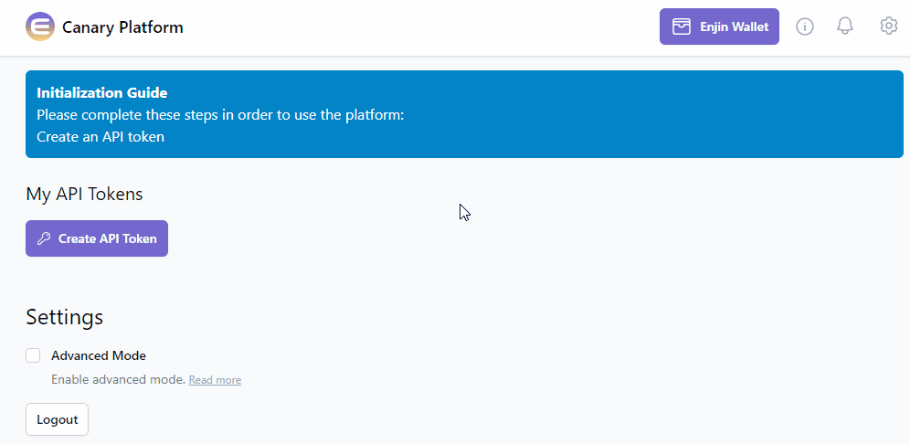
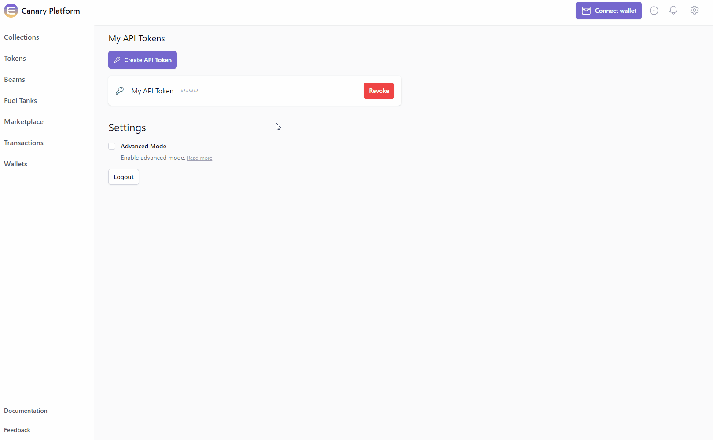
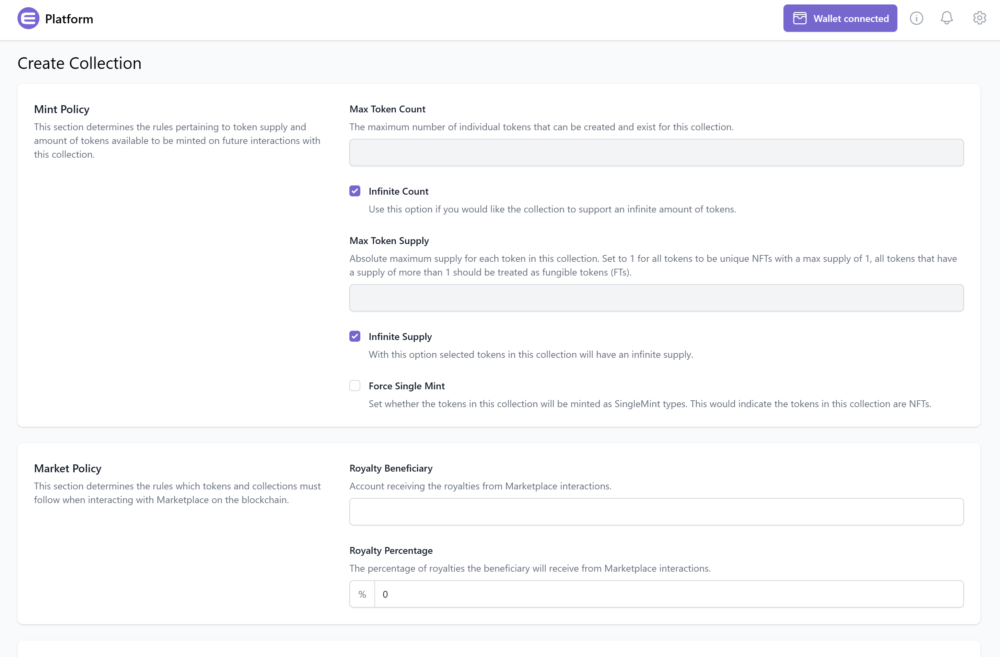

import GlossaryTerm from '@site/src/components/GlossaryTerm';
import Tabs from '@theme/Tabs';
import TabItem from '@theme/TabItem';

:::info What you'll need:
Some [Enjin Coin](doc:using-enjin-coin) to pay for <GlossaryTerm id="transaction_fees" /> and for <GlossaryTerm id="storage_deposit" />s.\
You can obtain cENJ (Canary ENJ) for testing from the [Canary faucet](https://faucet.canary.enjin.io/).
:::

# 1. Set Up an <GlossaryTerm id="enjin_platform" /> Account

To get started, go ahead and create an account on the <GlossaryTerm id="enjin_platform_cloud" /> and **verify your email address.** In this tutorial, we'll be using the [Enjin Platform Cloud (Testnet)](https://platform.canary.enjin.io).

:::info There are three versions of the Enjin Platform to choose from:
- The [Enjin Platform Cloud (Testnet)](https://platform.canary.enjin.io), connected to the Enjin <GlossaryTerm id="canary" /> <GlossaryTerm id="testnet" />.
- The [Enjin Platform Cloud (Mainnet)](http://platform.enjin.io/), connected to the Enjin <GlossaryTerm id="blockchain" /> <GlossaryTerm id="mainnet" />.
- The [Self-Hosted Platform](doc:open-source-platform) which you can run locally to connect to either network.
:::

## Things you should know

- <GlossaryTerm id="enjin_blockchain" /> is <GlossaryTerm id="immutable" />, which is why we recommend building your initial proof-of-concept on Enjin <GlossaryTerm id="canary" /> <GlossaryTerm id="testnet" /> – the fast and free environment for testing Enjin's tools.
- Every "<GlossaryTerm id="mutation" />" request (i.e, minting a <GlossaryTerm id="token" />) must be signed by a <GlossaryTerm id="wallet_account" />.

# 2. Set Up an API Token

Once your account is created, create a new API token by clicking the "**Create API Token**", which can be found on the [Account Settings](https://platform.canary.enjin.io/settings) page.



Copy and save that token somewhere safe, you'll need that to automatically approve transactions using a <GlossaryTerm id="wallet_daemon" />.

:::tip Note
You can always revoke the token and create another one in the future.
:::

# 3. Set Up a Wallet

Transactions can be approved in 2 different ways:

- **Manually:** Using the [Enjin Wallet](https://enjin.io/products/wallet) / [Polkadot.js](https://polkadot.js.org/).
- **Automatically:** Using the [Enjin Wallet Daemon](doc:wallet-daemon).

:::tip Start by manually approving transactions
If you're using the Enjin Platform for the first time, we recommend [Using Enjin Wallet / Polkadot.js](doc:using-the-enjin-platform#using-enjin-wallet--polkadotjs)\
Enjin wallet app is available on both [iOS](https://enj.in/ios-wallet) and [Android](https://enj.in/android-wallet).
:::

### A. Using Enjin Wallet / Polkadot.js

Connect your wallet by clicking the "**Connect Wallet**" button in the top right corner and follow the on-screen instructions.  
The <GlossaryTerm id="enjin_wallet_app" /> also offers gamers a user-friendly, secure, and rewarding experience, ensuring their continuous engagement with your game.



### B. Using Daemon Wallet

The Enjin Wallet Daemon can automatically sign requests for you.

To download and set up wallet daemon, head over to the [Wallet Daemon Setup](doc:wallet-daemon) page.  
To ensure that only authorized requests are approved, the Wallet daemon needs to be configured with an Enjin Platform API Token.  
Create an API Token on the [Account Settings](https://platform.canary.enjin.io/settings) page and set the Platform API Token in your Wallet Daemon configuration.

Once your wallet daemon is connected, your Platform account is set up and ready to use!

# 4. Create Platform Requests

Now that the Platform account is set up, we can start creating platform requests.  
In this example we will be creating a <GlossaryTerm id="collection" />.

**There are two ways to create Platform requests:**

- [Using the Platform User Interface](#option-a-using-the-platform-user-interface)
- [Using the GraphQL API](#option-b-using-the-graphql-api--sdks)

:::info Which approach should I use?
Everything that can be done via the Platform's User Interface, can be done programmatically via the <GlossaryTerm id="graphql" /> API or any of the Platform <GlossaryTerm id="sdk" />s.\
If you are just starting out, we recommend using the Platform User Interface as it's more user friendly.\
However, if you need to make a Platform request programmatically, you can do that via the <GlossaryTerm id="enjin_platform_api" /> / <GlossaryTerm id="sdk" />s.
:::

## Option A. Using the Enjin Dashboard

In the Platform menu, navigate to "**[Collections](https://platform.canary.enjin.io/collections)**". Then, click the "**[Create Collection](https://platform.canary.enjin.io/create/collection)**" button.



From here, you can customize your collection's Mint Policy, Market Policy, Explicit Royalty Currencies (optional), and Attributes.

Once you're satisfied with the options, click on the "**Create**" button at the bottom right corner to create the request.


## Option B. Using the Enjin API & SDKs

To create a Platform request programmatically, use the <GlossaryTerm id="graphql" /> API, or one of the <GlossaryTerm id="sdk" />s.  
This mutation will set up a new transaction that once finalized on-chain will contain the new collection id in the transaction <GlossaryTerm id="events" />. 

:::tip Test your requests in the GraphiQL Playground:
- [Testnet](https://platform.canary.enjin.io/graphiql)
- [Mainnet](https://platform.enjin.io/graphiql)
:::

:::tip
If you are not using the playground, you need to add your API token to the headers to be authenticated, like so:
```json
"Authorization": "<API Token Key Here>"
```
:::

<Tabs>
  <TabItem value="graphql" label="GraphQL">
```graphql
mutation CreateCollection {
  CreateCollection(mintPolicy: { forceCollapsingSupply: false }) #Set to true to enforce collapsing supply mint policy
  {
    id
    method
    state
  }
}
```
  </TabItem>
  <TabItem value="curl" label="cURL">
```json
curl --location 'https://platform.canary.enjin.io/graphql' \
-H 'Content-Type: application/json' \
-H 'Authorization: enjin_api_key' \
-d '{"query":"mutation Infuse(\r\n  $collection_id: BigInt!\r\n  $token_id: EncodableTokenIdInput!\r\n  $amount: BigInt!\r\n) {\r\n  Infuse(collectionId: $collection_id, tokenId: $token_id, amount: $amount) {\r\n    id\r\n    method\r\n    state\r\n  }\r\n}","variables":{"forceCollapsingSupply":false}}'
```
  </TabItem>
  <TabItem value="csharp-sdk" label="c# SDK">
```csharp
using System.Text.Json;
using Enjin.Platform.Sdk;

// Setup the mutation
var createCollection = new CreateCollection()
    .SetMintPolicy(new MintPolicy().SetForceCollapsingSupply(false)); //Set to true to enforce collapsing supply mint policy

// Define and assign the return data fragment to the mutation
var transactionFragment = new TransactionFragment()
    .WithId()
    .WithMethod()
    .WithState();

createCollection.Fragment(transactionFragment);

// Create and auth a client to send the request to the platform
var client = PlatformClient.Builder()
    .SetBaseAddress("https://platform.canary.enjin.io")
    .Build();
client.Auth("Your_Platform_Token_Here");

// Send the request and write the output to the console.
// Only the fields that were requested in the fragment will be filled in,
// other fields which weren't requested in the fragment will be set to null.
var response = await client.SendCreateCollection(createCollection);
Console.WriteLine(JsonSerializer.Serialize(response.Result.Data));
```
  </TabItem>
  <TabItem value="cplusplus-sdk" label="C++ SDK">
```cplusplus
#include "EnjinPlatformSdk/CoreMutations.hpp"
#include <memory>
#include <iostream>

using namespace enjin::platform::sdk;
using namespace std;

int main() {

    // Setup mutation data
    shared_ptr<MintPolicy> mintPolicy = make_shared<MintPolicy>();
    mintPolicy->SetForceSingleMint(make_shared<SerializableBool>(false));

    // Setup mutation
    CreateCollection createCollection = CreateCollection();
    createCollection.SetMintPolicy(mintPolicy);

    // Define and assign the return data fragment to the mutation
    shared_ptr<TransactionFragment> transactionFragment = make_shared<TransactionFragment>();
    transactionFragment
        ->WithId()
        .WithMethod()
        .WithState();

    createCollection.SetFragment(transactionFragment);

    // Create and auth a client to send the request to the platform
    unique_ptr<PlatformClient> client = PlatformClient::Builder()
            .SetBaseAddress("https://platform.canary.enjin.io")
            .Build();
    client->Auth("Your_Platform_Token_Here");

    // Send the request then get the response and write the output to the console.
    // Only the fields that were requested in the fragment will be filled in,
    // other fields which weren't requested in the fragment will be set to null.
    future<shared_ptr<IPlatformResponse<GraphQlResponse<Transaction>>>> futureResponse = SendCreateCollection(*client, createCollection);

    // Get the platform response holding the HTTP data
    PlatformResponsePtr<GraphQlResponse<Transaction>> response = futureResponse.get();

    // Get the result, a GraphQL response, holding the GraphQL data
    const optional<GraphQlResponse<Transaction>>& gqlResult = response->GetResult();

    // Write the result data to the console
    if (gqlResult.has_value() && gqlResult->IsSuccess())
    {
        const optional<Transaction>& transaction = gqlResult->GetData()->GetResult();

        std::cout << to_string(transaction->GetId().value()) << std::endl;
        std::cout << ToString(transaction->GetMethod().value()) << std::endl;
    }
  
     // Write any error messages to the console
    if (gqlResult.has_value() && gqlResult->HasErrors())
    {
        const optional<vector<GraphQlError>>& errors = gqlResult->GetErrors();

        for (const GraphQlError& error : errors.value()) {
            std::cout << error.GetMessage().value() << std::endl;
        }
    }

    client.reset();

    return 0;
}
```
  </TabItem>
  <TabItem value="js" label="Javascript">
```javascript
fetch('https://platform.canary.enjin.io/graphql', {
  method: 'POST',
  headers: {'Content-Type': 'application/json','Authorization': 'Your_Platform_Token_Here'},
  body: JSON.stringify({
    query: `
      mutation CreateCollection($forceCollapsingSupply: Boolean) {
        CreateCollection(
          mintPolicy: { forceCollapsingSupply: $forceCollapsingSupply }
        ) {
          id
          method
          state
        }
      }
    `,
    variables: {
      forceCollapsingSupply: false //Set to true to enforce collapsing supply mint policy
    }
  }),
})
.then(response => response.json())
.then(data => console.log(data));
```
  </TabItem>
  <TabItem value="nodejs" label="Node.js">
```javascript
const axios = require('axios');

axios.post('https://platform.canary.enjin.io/graphql', {
  query: `
    mutation CreateCollection($forceCollapsingSupply: Boolean) {
      CreateCollection(
        mintPolicy: { forceCollapsingSupply: $forceCollapsingSupply }
      ) {
        id
        method
        state
      }
    }
  `,
  variables: {
    forceCollapsingSupply: false //Set to true to enforce collapsing supply mint policy
  }
}, {
  headers: { 'Content-Type': 'application/json', 'Authorization': 'Your_Platform_Token_Here' }
})
.then(response => console.log(response.data))
.catch(error => console.error(error));
```
  </TabItem>
  <TabItem value="python" label="Python">
```python
import requests

query = '''
mutation CreateCollection($forceCollapsingSupply: Boolean) {
  CreateCollection(
    mintPolicy: { forceCollapsingSupply: $forceCollapsingSupply }
  ) {
    id
    method
    state
  }
}
'''

variables = {'forceCollapsingSupply': False} #Set to true to enforce collapsing supply mint policy

response = requests.post('https://platform.canary.enjin.io/graphql',
	json={'query': query, 'variables': variables},
	headers={'Content-Type': 'application/json', 'Authorization': 'Your_Platform_Token_Here'}
)
print(response.json())
```
  </TabItem>
</Tabs>

A WebSocket event will also be fired so you can pick up the collection in real time by listening to the app channel on the WebSocket.

# 5. Approve Platform Requests

Once a Platform request is created, all that remains is to approve it, which will sign the transaction and broadcast it to the Enjin Blockchain

Transaction requests are displayed in the "**[Transactions](https://platform.canary.enjin.io/transactions)**" menu.


Since this transaction is a <GlossaryTerm id="mutation" />, you will need to sign the transaction using your Wallet.

- If a **Wallet Daemon is running and configured**, the transaction request will be **signed automatically**.
- If **a wallet is connected** such as the Enjin Wallet or Polkadot.js, the transaction must be **signed manually** by clicking the "**Sign**" button and **approving the signature request** in your wallet.  


And that's it! The transaction is then broadcasted to the Enjin Blockchain, and once approved, it will be included in a <GlossaryTerm id="block" />.

# 6. Receive Transaction Information

There are 3 ways to receive the transaction status and information:

- [Receive Transaction Information Using the Platform User Interface](#receive-transaction-information-using-the-platform-user-interface)
- [Receive Transaction Information Using the GraphQL API / SDKs](#receive-transaction-information-using-the-graphql-api--sdks)
- [Receive Transaction Information by Listening to Platform Websocket Events](#receive-transaction-information-by-listening-to-platform-websocket-events)

### Receive Transaction Information Using the Platform User Interface

To check the transaction status, head over to the [Transactions](https://platform.canary.enjin.io/transactions) page locate the transaction and click on the button to it's right to show more details.  
Once the transactions approves on-chain, the transaction will get updated with the `FINALIZED` state and the transaction events will be displayed.  
In the events, we can find useful information, such as the newly created collection ID.


### Receive Transaction Information Using the Enjin API & SDKs

To receive the transaction information programmatically, You can use the `GetTransaction` query and set the `id` to the ID received in the `CreateCollection` mutation.  
But for this example, we're going to use the `GetPendingEvents` query, which returns all of the events emitted to your platform account.

:::info This query might return items in multiple pages using Connections
To learn how to use GraphQL cursors for pagination, head to [Using the API --> Pagination](doc:using-graphql#pagination).
:::

**Query:**

<Tabs>
  <TabItem value="graphql" label="GraphQL">
```graphql
query GetPendingEvents{
  GetPendingEvents{
    edges{
      node{
        name
        data
      }
    }
  }
}
```
  </TabItem>
  <TabItem value="curl" label="cURL">
```
curl --location 'https://platform.canary.enjin.io/graphql' \
-H 'Content-Type: application/json' \
-H 'Authorization: enjin_api_key' \
-d '{"query": "query GetPendingEvents { GetPendingEvents { edges { node { name data } } } }"}'
```
  </TabItem>
  <TabItem value="csharp-sdk" label="c# SDK">
```csharp
using System.Text.Json;
using Enjin.Platform.Sdk;

var filterInputArray = new StringFilterInput[]
{
    new StringFilterInput()
        .SetType(FilterType.And)
        .SetFilter("collection;2000"),
};

// Setup the query
var getPendingEvents = new GetPendingEvents()
    .SetChannelFilters(filterInputArray);

// Define and assign the return data fragment to the query
var pendingEventsFragment = new ConnectionFragment<PendingEventFragment>()
    .WithEdges(new EdgeFragment<PendingEventFragment>()
        .WithNode(new PendingEventFragment()
            .WithId()
            .WithUuid()
            .WithName()
            .WithSent()
            .WithChannels()
            .WithData()
        )
    );

getPendingEvents.Fragment(pendingEventsFragment);

// Create and auth a client to send the request to the platform
var client = PlatformClient.Builder()
    .SetBaseAddress("https://platform.canary.enjin.io")
    .Build();
client.Auth("Your_Platform_Token_Here");

// Send the request and write the output to the console.
// Only the fields that were requested in the fragment will be filled in,
// other fields which weren't requested in the fragment will be set to null.
var response = await client.SendGetPendingEvents(getPendingEvents);
Console.WriteLine(JsonSerializer.Serialize(response.Result.Data));
```
  </TabItem>
  <TabItem value="cplusplus-sdk" label="C++ SDK">
```cplusplus

```
  </TabItem>
  <TabItem value="js" label="Javascript">
```javascript
fetch('https://platform.canary.enjin.io/graphql', {
  method: 'POST',
  headers: {'Content-Type': 'application/json','Authorization': 'Your_Platform_Token_Here'},
  body: JSON.stringify({
    query: `
      query GetPendingEvents{
        GetPendingEvents{
          edges{
            node{
              name
              data
            }
          }
        }
      }
    `,
  }),
})
.then(response => response.json())
.then(data => console.log(data));
```
  </TabItem>
  <TabItem value="nodejs" label="Node.js">
```javascript
const axios = require('axios');

axios.post('https://platform.canary.enjin.io/graphql', {
  query: `
    query GetPendingEvents{
      GetPendingEvents{
        edges{
          node{
            name
            data
          }
        }
      }
    }
  `,
}, {
  headers: { 'Content-Type': 'application/json', 'Authorization': 'Your_Platform_Token_Here' }
})
.then(response => console.log(response.data))
.catch(error => console.error(error));
```
  </TabItem>
  <TabItem value="python" label="Python">
```python
import requests

query = '''
  query GetPendingEvents{
    GetPendingEvents{
      edges{
        node{
          name
          data
        }
      }
    }
  }
'''

response = requests.post('https://platform.canary.enjin.io/graphql',
	json={'query': query},
	headers={'Content-Type': 'application/json', 'Authorization': 'Your_Platform_Token_Here'}
)
print(response.json())
```
  </TabItem>
</Tabs>

**Response:**

```json
{
  "data": {
    "GetPendingEvents": {
      "edges": [
        {
          "node": {
            "name": "platform:transaction-created",
            "data": {
              "id": 1648,
              "state": "PENDING",
              "method": "CreateCollection",
              "idempotencyKey": "00e32324-acfa-4ddb-8b7d-6dd8d0b4f694"
            }
          }
        },
        {
          "node": {
            "name": "platform:transaction-updated",
            "data": {
              "id": 1648,
              "state": "BROADCAST",
              "method": "CreateCollection",
              "result": null,
              "transactionId": null,
              "idempotencyKey": "00e32324-acfa-4ddb-8b7d-6dd8d0b4f694",
              "transactionHash": "0xeb2510094c53317e19ca188b5ba8a21b81f36f4bc1be09e079b46ee7b9bce754"
            }
          }
        },
        {
          "node": {
            "name": "platform:collection-created",
            "data": {
              "owner": "cxLU94nRz1en6gHnXnYPyTdtcZZ9dqBasexvexjArj4V1Qr8f",
              "collectionId": "38224",
              "idempotencyKey": "00e32324-acfa-4ddb-8b7d-6dd8d0b4f694"
            }
          }
        },
        {
          "node": {
            "name": "platform:transaction-updated",
            "data": {
              "id": 1648,
              "state": "FINALIZED",
              "method": "CreateCollection",
              "result": "EXTRINSIC_SUCCESS",
              "transactionId": "1404095-2",
              "idempotencyKey": "00e32324-acfa-4ddb-8b7d-6dd8d0b4f694",
              "transactionHash": "0xeb2510094c53317e19ca188b5ba8a21b81f36f4bc1be09e079b46ee7b9bce754"
        }
      ]
    }
  }
}
```

The first event with `PENDING` state was emitted when the `CreateCollection` platform request was created.  
The second event with `BROADCAST` state was emitted when the transaction was signed and broadcasted to the Enjin Blockchain.  
The third event was emitted when the collection was created on-chain, and has the `collectionId` in it's data.  
The forth and final event with `FINALIZED` state was emitted when the platform request was finalized.

:::info Note
For the full list of platform states, check the [Enjin API --> Important Arguments](doc:important-arguments#state) page.
:::

:::tip Acknowledging Events
To remove the pending events from the queue after fetching them, set the `acknowledgeEvents` parameter to true
:::

### Receive Transaction Information by Listening to Platform Websocket Events

You can also subscribe for events via Websocket. for more information, check out the [Websocket Events](doc:websocket-events)

:::info The <GlossaryTerm id="self_hosted_enjin_platform" />
Once you've fully tested the <GlossaryTerm id="enjin_platform_cloud" />, you may consider transitioning to the <GlossaryTerm id="self_hosted_enjin_platform" /> for the following reasons:
- Complete control over data and infrastructure.
- Eliminates dependence on third-party servers.
- Enhanced customization and scalability.
- Ideal for projects requiring advanced features and customization options.
- Ensures full ownership and autonomy over your NFT platform.

To set it up, check out the [Self-Hosted Platform](doc:open-source-platform) page.
:::

:::tip What's Next?
Learn how to [Use the API](https://docs.enjin.io/docs/using-enjin-api).
:::
