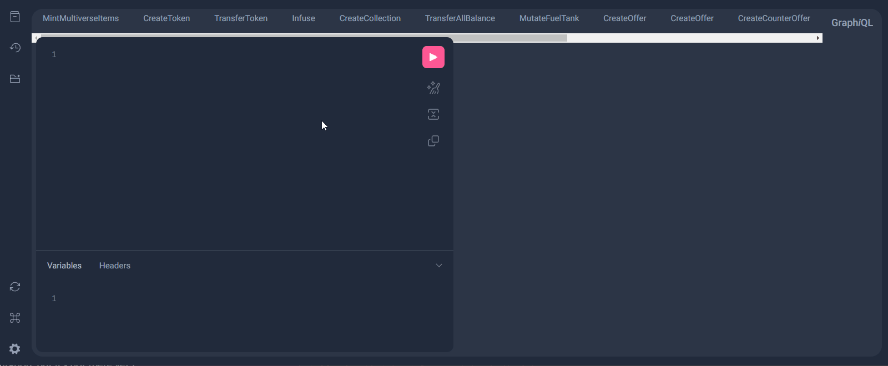
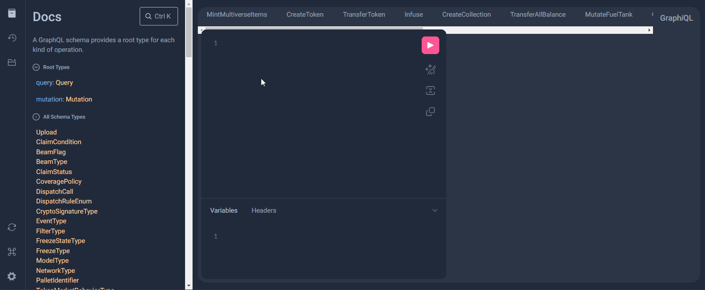
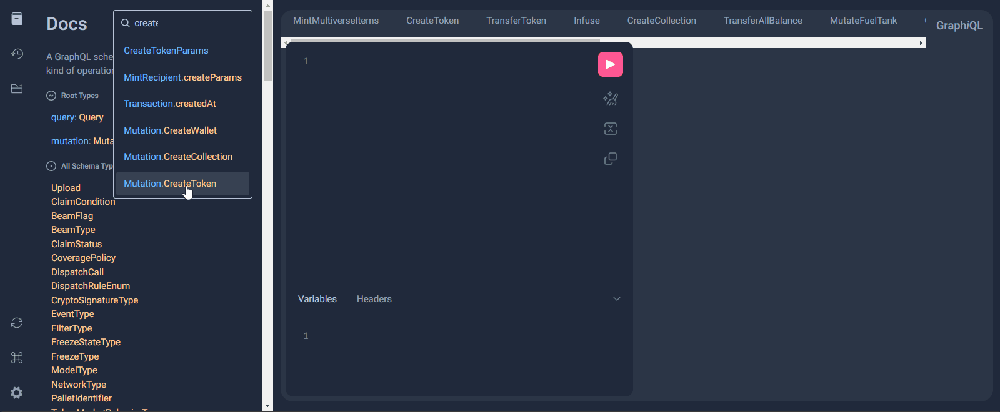
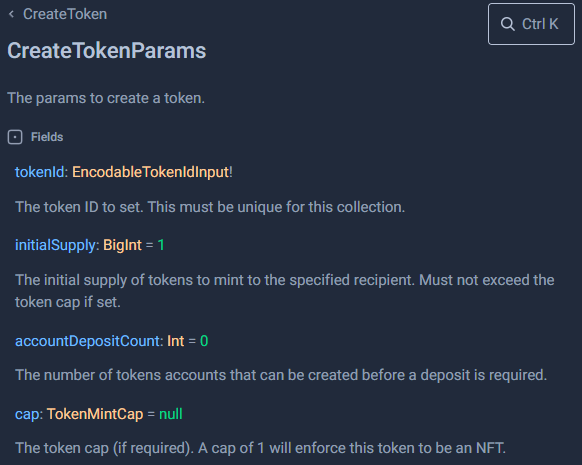

The Enjin API provides a robust GraphQL interface for interacting with the Enjin Platform. This guide will demonstrate how to explore available queries and mutations using the GraphiQL Playground.

## Exploring the GraphiQL Playground

The GraphiQL Playground is an interactive environment where developers can explore the full range of API functionalities and build queries/mutations. Here’s how you can navigate and utilize this tool effectively.

### Accessing the GraphiQL Playground

You can access the GraphiQL Playground for both Testnet and Mainnet environments:

- **Testnet**: [Core Operations](https://platform.canary.enjin.io/graphiql)
- **Mainnet**: [Core Operations](https://platform.enjin.io/graphiql)

### Navigating the Documentation Explorer

#### Step 1: Open the Documentation Explorer

- Start by opening the GraphiQL Playground and click the `Show Documentation Explorer` button located at the top left. This will display a panel listing all available queries, mutations, and types.



#### Step 2: Search for a Specific Mutation

- In the Documentation Explorer, you can use the search input to find a specific mutation. For example, to find the "CreateToken" mutation, type "Create" into the search bar. This helps narrow down the list to relevant operations.



:::tip Tip: quick Access to Documentation
If you already have a query or mutation in your builder, you can quickly open its documentation page by clicking on it while holding the `Ctrl` button. This will navigate you directly to its details in the Documentation Explorer.
:::

#### Step 3: Explore the Mutation Details

- Click on the "CreateToken" mutation to view detailed information about it. You will see:
  - **Overview**: A description of what the mutation does.
  - **Return Type**: The type of data it returns, such as a "transaction".
  - **Arguments**: A list of arguments it accepts, with descriptions and data types.



### Understanding Arguments and Types

#### Example: Creating a Token with Initial Supply of 10

- For instance, if you want to create a token with an initial supply of 10, you will need to focus on the `params` argument. This argument is of type "CreateTokenParams", a complex type.


- Click on `CreateTokenParams` to explore its fields:
  - **tokenId**: Of type "EncodableTokenIdInput", which specifies the token identifier.
  - **initialSupply**: Of type "BigInt", which you would set to 10.
  - **cap**: Of type "TokenMintCap", which may define the maximum supply (optional).



#### Constructing Your Mutation

- Using the information from the Documentation Explorer, you can construct a mutation to create a token. Here is an example:

```graphql
mutation {
  CreateToken(
    recipient: "efRecipientAddress"
    collectionId: "12345"
    params: {
      tokenId: { integer: 1 }
      initialSupply: 10
    }
  ) {
    id
    method
    state
  }
}
```

- This mutation creates a new token with an initial supply of 10 in the specified collection. Adjust the parameters as needed for your application.

:::tip Not sure how to construct the query/mutation?
Check out our [GraphQL Query Builder Guide](/01-getting-started/04-using-enjin-api/01-how-to-use-graphql.md#graphiql-playground) for detailed instructions on building queries and mutations.
:::

#### Conclusion

By using the Documentation Explorer in the GraphiQL Playground, you can efficiently navigate and understand the Enjin API's queries, mutations, and field types.
