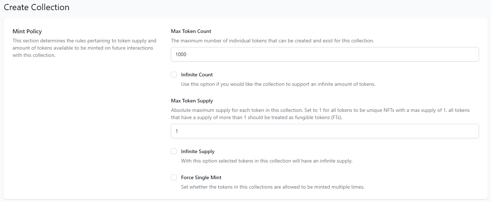
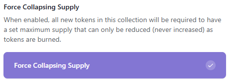

import GlossaryTerm from '@site/src/components/GlossaryTerm';

# NFT Collection

Consider a situation where your goal is to create a <GlossaryTerm id="collection" /> limited to 1,000 tokens, where each token is an <GlossaryTerm id="nft" /> symbolizing a distinct in-game sword.

Accomplishing this requires the right configuration of your Mint Policy:

By setting the "**Max Token Count**" to `1,000`, you can cap the total number of tokens in the swords collection to 1,000.

Meanwhile, setting the "**Max Token Supply**" to `1` ensures that each token in the swords collection will have a maximum supply of `1`. This enforces the uniqueness of each token in the collection, enforcing each token in the collection to be an NFT.

# Immutable Tokenomics

Suppose you want to create a <GlossaryTerm id="collection" /> with one simple but crucial rule: Each token has a pre-defined max supply which can only be decreased.  
Achieving this requires careful configuration of your Mint Policy:

By toggling the "**Force Collapsing Supply**", you ensure that each token in the collection will be of collapsing supply type.  
This guarantees the immutability of each token's maximum supply in the collection, maintaining its value and scarcity over time.
