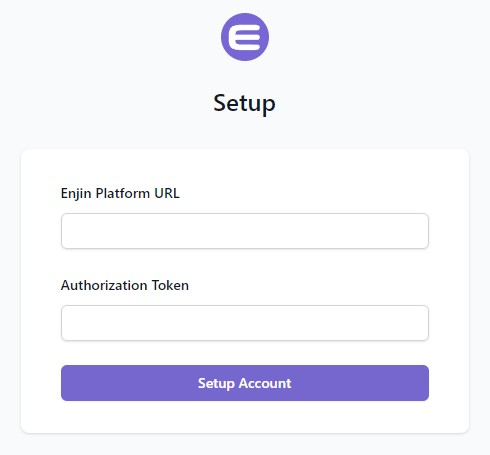

:::warning This steps are required only if the UI package is installed
If you want to use the Enjin Platform with a User Interface, make sure to [install the platform-ui package first](doc:installing-additional-packages)
:::

If you would like to use the Platform UI package then there is a separate install process to run through as follows, and make sure you have your authentication token handy to paste in.

:::info Pre-requisites for Platform UI Setup
The UI requires a minimum of 2GB RAM to build, so you may need to resize your Droplet temporarily if you started with 1GB
:::

To start the platform-ui installation process, run these commands:

```bash
cd /var/www/laravel/

php artisan platform-ui:install
```

The installer will ask a few questions, such as your platform URL, the auth token you set and so on.

- When asked to enter your Enjin Platform URL, insert your public droplet IP, or domain if you set one up.
- When asked to enter the default route path, insert `/`(forward slash) if you don't wish to use any specific route.

Once it's finished installing, you should be able to load up the UI by going to the path you specified for the 'default route path' step.



When logging in to the Platform, it'll ask for the `Enjin Platform URL` and `Authorization Token` you used to set up the platform, for authentication purposes.  
Once Inserted, you will be redirected to the platform UI and you'll be able to start using it.
