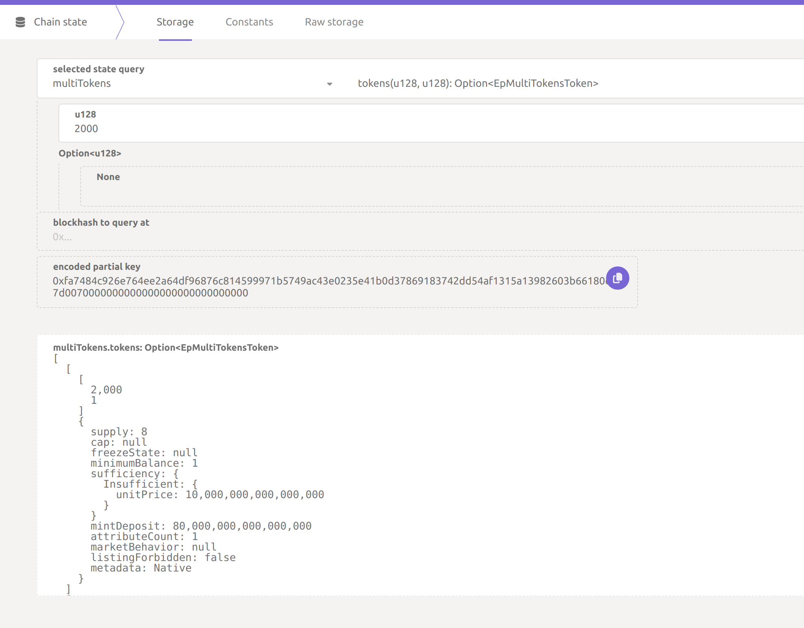

import GlossaryTerm from '@site/src/components/GlossaryTerm';

The chain state of a blockchain is a snapshot of all the data it contains at a given moment. 

This includes account balances, ownership of digital assets, and other on-chain information. 

It's regularly updated through the network's consensus algorithm to maintain data integrity.

To query this state, there are several methods, but let's focus on using the Enjin Console and the Enjin Platform:

# Enjin Platform

The Enjin Platform uses a blockchain indexer to gather transactions, aiming to provide the latest chain state as quickly as possible. 

Direct queries to the blockchain via an RPC node are possible but can be demanding on resources, especially with many simultaneous queries. Indexers mitigate this issue.

With the Enjin Platform, you can use advanced queries involving multiple relationships to get data faster than directly from RPC nodes. 

Here's an example of a query in the GraphiQL playground, showing the state of collection ID 2000:

```graphql
query GetCollection {
  GetCollection(collectionId: 2000) {
    owner {
      account {
        address
      }
    }
    maxTokenCount
    maxTokenSupply
    forceSingleMint
    frozen
    tokens {
      totalCount
      edges {
        node {
          tokenId
        }
      }
    }
  }
}
```
```json
{
  "data": {
    "GetCollection": {
      "owner": {
        "account": {
          "address": "efTpCuJYg7jnjA8HxYb9dFKp7eCP7WKKHVoCjqy1Dt7NABds6"
        }
      },
      "maxTokenCount": null,
      "maxTokenSupply": null,
      "forceSingleMint": false,
      "frozen": false,
      "tokens": {
        "totalCount": 0,
        "edges": []
      }
    }
  }
}
```

:::warning Current Chain State
It's important to know that the Enjin Platform only keeps track of the current state of the chain. This means you can't check what happened in the past blocks. The platform is designed for giving you up-to-date information about the chain's current state, not for looking at its history.
:::

# Enjin Console

## Connecting to the Enjin Console

Open the Enjin Console, you can connect to the network by clicking on the following URL: https://console.enjin.io/


# Querying the data

To look up data from a specific module (called a <GlossaryTerm id="pallet" />) on the Chainstate page of the Enjin Console, you just need to pick the pallet you're interested in and then select the data item you need from that pallet.

Remember that the database used by the blockchain node is structured like a tree (specifically, a radix tree), which is different from a standard SQL database. 

- **Pallet Storage** on a blockchain is like a separate database for each category of data. 
- **Specific Storage** within a pallet is akin to a table in a database, holding actual data entries. 

Unlike a traditional SQL database with tables, a blockchain organizes data in a tree structure for efficiency, but the concept of separate areas for different data types (pallets) and specific datasets (storages) within those areas is similar.



:::tip Specifying the Block Hash
If you do not enter the block hash to query, the chain state displayed to you will always represent the latest block created in the network.
:::
