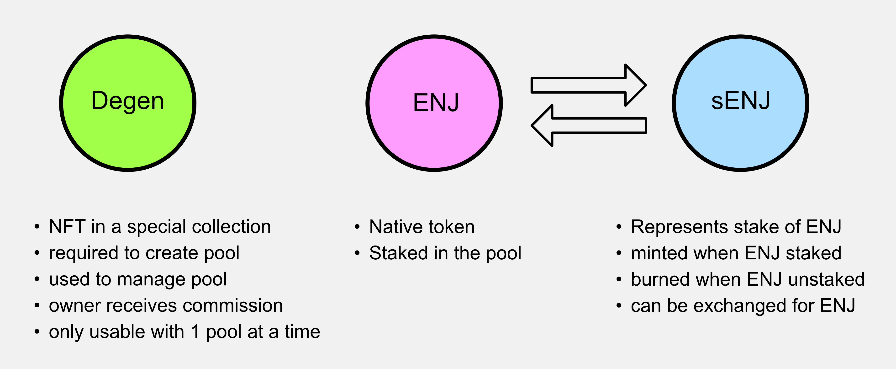
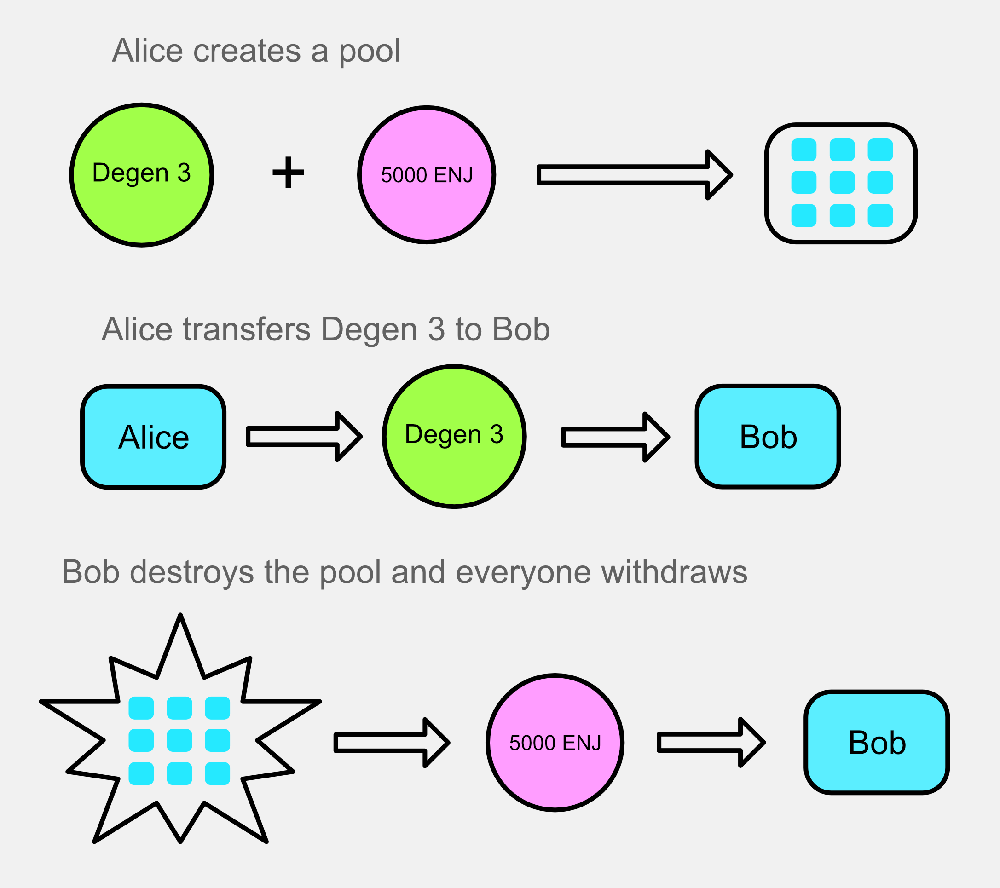
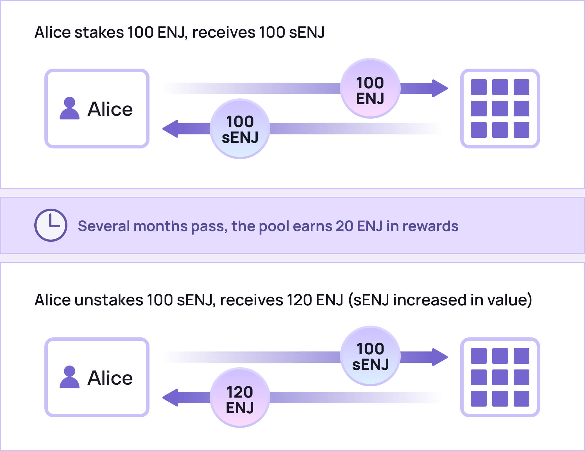
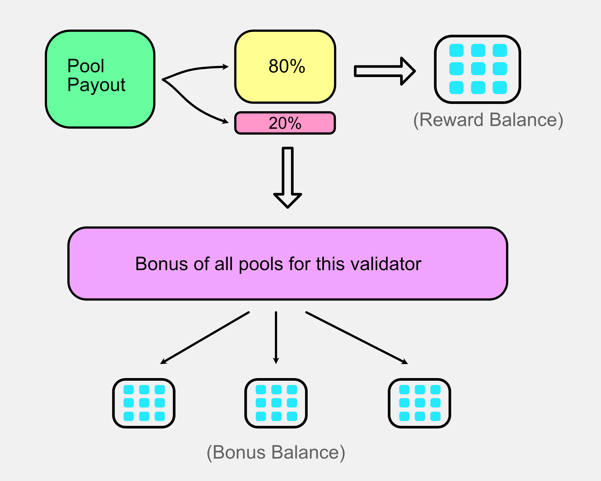
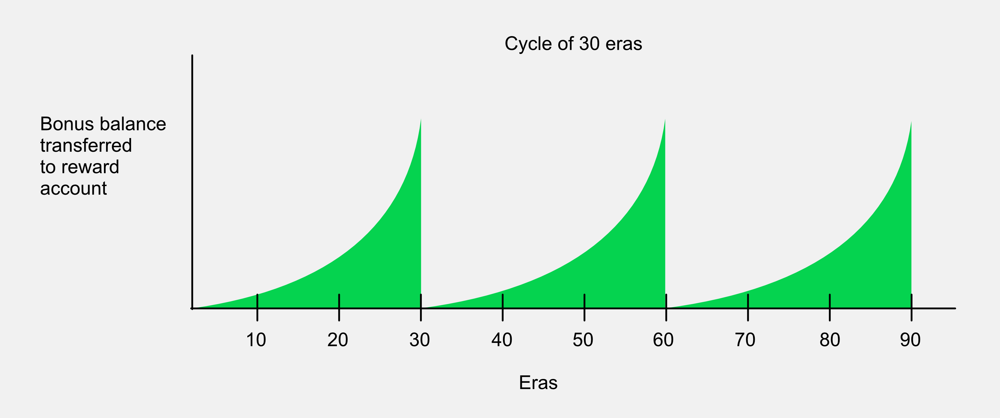

This is an overview of staking on Enjin Relaychain, known as liquid staking.

:::info The Enjin Blockchain Console
Use [console.enjin.io](https://console.enjin.io/) to use the user interface referenced in this document.
:::

## Concepts

- **Direct staking -** A user stakes directly to one or more validators and is paid directly by them.
- **Nomination Pool (indirect staking) -** One account stakes funds that represent a group of users. This account handles the nominating and receives the rewards.
- **Liquid staking -** a token is received that represents the user's stake. The staked token can be used (is liquid) while the user is staked. It is minted when the user stakes and burned when they unstake. It can also be exchanged for the real token.
- **Validator -** Provides security for the network and receives rewards for doing so. On Enjin, these rewards are distributed to nomination pools. (A list of active validators can be seen on [Subscan](https://enjin.subscan.io/validator).)
- **Nominator -** The account that chooses a validator to stake with. In the case of Enjin, this is the nomination pool's account.
- **Commission - **A percentage of the rewards taken for offering a service. On Enjin, a commission can be taken by both the validator and the holder of the Degen NFT.

## Nomination Pools vs Direct Staking

On Enjin, we use nomination pools to handle staking due to the increased simplicity and lower minimums. Another type of staking supported on substrate is direct staking, where a user stakes directly to a validator, but it has several disadvantages.

### Nomination Pools with liquid staking

With nomination pools, there is one account that multiple users put their funds into. This account acts as the nominator and receives the rewards. The liquid token, sENJ, is used to represent a user's stake in the pool.

- **Low minimum (1 ENJ) - **pools can have lower minimums per user because all of the pool's funds are staked together  
  Easy to use - users only need to choose a pool, no need to choose validators
- **Receive liquid token -** a liquid token, sENJ, is received that represents the user's stake. This can be transferred or even exchanged for ENJ
- **Immediate exit -** due to the liquid token, the user can exit immediately by exchanging their sENJ for ENJ

  

### Direct Staking

:::note
Direct staking is not supported on Enjin. This information is just for comparison.
:::

- **High minimum -** direct staking has a high minimum balance. On polkadot, it's 250 DOT.
- **Must choose validators -** each validator must be manually chosen. This can be difficult for new users.
- **Staked token is locked -** the staked token cannot be used while staked
- **Stash / controller accounts -** multiple accounts must be created, increasing complexity
- **28 days unbonding period -** users must wait 28 days after unbonding to receive their funds

  

## Tokens Overview

There are three tokens relevant to staking:

- **ENJ -** ENJ is the native token of the Enjin network. It is the token staked in the pool.
- **sENJ -** sENJ is the liquid token that represents staked ENJ. It is minted when ENJ is staked and burned when ENJ is unstaked. It can also be exchanged for ENJ through the exchange pallet.
- **Degen Token -** The degen token is an NFT in a special collection. It is required to create a pool and is also used to manage the pool. The owner of this NFT can optionally receive a commission. Each token is only usable in one pool at a time.

## Deposit

A deposit is reserved when the pool is created. This deposit will be released to the holder of the degen token when the pool is destroyed. Here's an example:

1. Alice creates a pool with degen 3 and 5000 ENJ
   1. ENJ is locked in a pool as deposit
   2. Degen 3 is associated with the pool
   3. Alice receives commissions
2. Alice transfers degen 3 to Bob
   1. Bob begins receiving commissions
   2. Bob can now manage the pool
3. Bob destroys the pool and everyone withdraws
   1. Bob gets the 5000 ENJ deposit because he holds the degen
   2. Bob would actually get slightly more than 5000 ENJ because the deposit is staked, so he would get the rewards as well

## ENJ & sENJ

Here's an example to show the relationship between ENJ and sENJ. The important thing to understand is that although the number of sENJ does not change as rewards are distributed, its value increases because it represents a proportion of the total ENJ in the pool.

## Bonus Cycle

There are two balances in a pool.

- reward balance - rewards from the pool
- bonus balance - part of the rewards that are held and distributed in cycles

80% of the rewards are distributed immediately, 20% are put into the bonus balance. Bonuses are calculated per validator. As the graphic shows, the 20% is collected at the beginning of the payout, then it is distributed to each pool's bonus account. Pools with longer bonus cycles get more bonus.

Each era, some amount of bonus is distributed from each pool's bonus account to its rewards account. This amount changes depending on the pool's bonus cycle. A small amount of bonus is distributed at the beginning of the cycle, but at the end, each era distributes a large amount of bonus. By the end of the cycle, the whole bonus is distributed, and the cycle restarts.

## Payouts

Payouts do not happen automatically. The payout_rewards extrinsic should be called once per validator per era. This extrinsic does two things:

1. Collect rewards
   1. For the era it is called in, it collects the staking rewards from the validator. As stated above, some of this goes directly to the reward account. The rest goes through several calculations some portion goes into each pool's bonus account.
2. Distribute rewards
   1. The reward distribution happens for the previous era, so it's always one era behind. It is done this way because it needs to wait for the pools to collect rewards from all validators. It does the following:
      1. If the pool has reached the end of its cycle, it cycles the pool
      2. Sends bonus for era from the bonus account to the rewards account
      3. Sends reward commission to the degen token holder
      4. The pool's reward balance is staked (reinvested) so that rewards will be as high as possibl

## Extrinsics Overview

Here's an overview of the extrinsics (operations) in pallet-nomination-pools.

### Administration

These extrinsics are for creating or modifying pools and require special permissions. Some must be called directly by the owner of the degen NFT, and a few can be called if assigned to a specific role.

- **`create`** - creates a new pool. Requires the degen NFT and the deposit.
- **`chill`** - stops the pool from receiving rewards.
- **`destroy`** - puts the pool into the destroying state
- **`nominate`** - nominates validators for the pool
- **`mutate`** - makes changes to the pool

### Members

These are the extrinsics that will be called by users (members) of the pool.

- **`bond`** - bonds ENJ to the pool. The user receives sENJ.
- **`unbond`** - Unbonds sENJ. The user burns sENJ.
- **`withdraw_unbonded`** - The ENJ is received from unbonding after the unbonding period has passed.

### Permissionless

These extrinsics can be called by anyone. Some of them can only be called when the pool is in the `Destroying` state.

- **`payout_rewards`** - This can be called by anyone, and should be called once per validator per era. It distributes the payouts and handles calculations like bonuses and commissions.
- **`unbond_deposit` **- Unbonds the deposit. Only callable after the pool is destroyed and all members have left the pool.
- **`withdraw_deposit`** - Withdraws the deposit. Can only be called after the deposit is unbonded. The pool will be destroyed (deleted) after this is called successfully.
