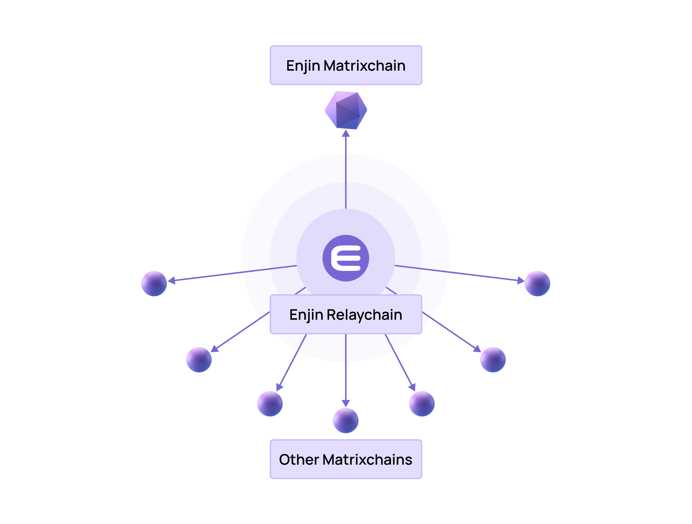

import GlossaryTerm from '@site/src/components/GlossaryTerm';

## What is Enjin Relaychain?

Enjin Relaychain is a decentralized and scalable network built for digital assets and non-fungible tokens (NFTs). It is based on Polkadot and uses the open-source Substrate framework to provide a comprehensive and efficient ecosystem for NFT creation. With superior functionality, speed, and low costs, Enjin Blockchain is designed to enhance the creation and management of digital assets in a secure and reliable manner.

## Benefits of the Enjin Relaychain:

1. Scalability: Enjin Relaychain is built to be highly scalable, enabling a significant increase in transaction throughput and enhanced performance for NFT projects, games, brands, and communities around the globe. This scalability is achieved through a unique architecture that leverages a multi-chain approach, allowing for parallel processing of transactions, reducing bottlenecks, and optimizing the use of resources.
2. Customizable Matrix Chains: Enjin Relaychain features a primary Relay chain and several Matrix Chains, which can be customized to meet the specific needs of different use cases. The Relay chain is optimized for security, network synchronicity, and block validation, while the Matrix Chains are specialized blockchains that can prioritize speed, scalability, and cost efficiency. By offloading security and integrity to the Relay chain, Matrix Chains can evolve and adapt to changing market demands without compromising their unique features or properties. This architecture provides the flexibility and agility needed for NFT projects, games, brands, and communities to innovate and thrive.
3. Predictable Scalability and Costs: Enjin Blockchain takes a different approach to scalability and costs than other blockchain networks by creating an interoperable network of Matrix Chains with predictable scalability and costs. Unlike the auction-based parachain lease model used in Polkadot, Enjin's approach eliminates the hindrances and risks associated with parachain auctions and high development costs. This makes it easier and more cost-effective to launch and upgrade Matrix Chains, providing a predictable and reliable environment for developers and businesses to build on.
4. Streamlined Staking: Enjin Relaychain uses a nominated proof-of-stake mechanism on the Relaychain to maintain security. Staking is simplified through an intuitive user interface that is accessible directly from the Enjin Wallet. Users can easily allocate Enjin Coin to a curated nomination pool with just one click, removing the need for manually selecting individual nodes. The staked amount remains highly liquid and can be used within the Enjin ecosystem, without requiring it to be unbound from the nomination pool beforehand. This ensures the coin's utility and enables users to participate in securing the network seamlessly.
5. Inclusivity and Accessibility: Enjin Blockchain is founded on the principles of inclusivity and accessibility. It provides an opportunity for anyone to participate in network security and earn Enjin Coin rewards. With pre-configured packages, anyone can deploy a <GlossaryTerm id="validator_node" />, <GlossaryTerm id="collator" /> Node, or Nomination Pool without the need for complex technical knowledge, making it easy for users to contribute to the network. This approach ensures that the network is open and accessible to all, promoting inclusivity and community involvement.
6. Seamless Integration with Enjin Products: Enjin Relaychain seamlessly integrates with popular Enjin products, such as the Enjin Wallet, NFT.io - NFT Marketplace, Enjin Platform, Enjin Beam, Enjin Web Wallet, Enjin Platform SDKs, and more. This provides a comprehensive and end-to-end integrated ecosystem, delivering a smooth experience for both users and developers. The integration ensures that all Enjin products leverage the benefits of the Relaychain, including scalability, low costs, and increased speed.

Enjin Relaychain is a decentralized, multi-chain network that aims to provide a superior digital asset ecosystem for NFT projects, games, brands, and communities globally. Its nominated proof-of-stake staking structure guarantees regulatory compliance and security. Enjin Relaychain offers the following key features and benefits:

- Scalable and customizable multi-chain network;
- Enhanced NFT creation capabilities;
- Predictable scalability and costs;  
  User-friendly staking;
- Inclusive and accessible for all users;
- Seamlessly integrated with Enjin products.

Overall, Enjin Relaychain offers a secure and efficient platform for creating and managing NFT projects, games, and communities. Its features and benefits are designed to make the process of creating and managing digital assets more accessible, cost-effective, and efficient while ensuring regulatory compliance and security.
