import GlossaryTerm from '@site/src/components/GlossaryTerm';

:::info The Enjin Blockchain Console
Use [console.enjin.io](https://console.enjin.io/) to use the user interface referenced in this document.
:::

## What is the MultiTokens <GlossaryTerm id="pallet" />?

The Enjin Blockchain has a token standard called MultiTokens. The standard is compatible with matrixchains, parachains, parathreads and smart contracts, so it’s interoperable with the entire Enjin, Polkadot and Kusama ecosystem.

**<GlossaryTerm id="multi_unit_token" />** are stackable, have a quantity and optional decimal places. An example of a multi-unit token is a twenty dollar bill - each bill is worth the same amount as another twenty dollar bill.

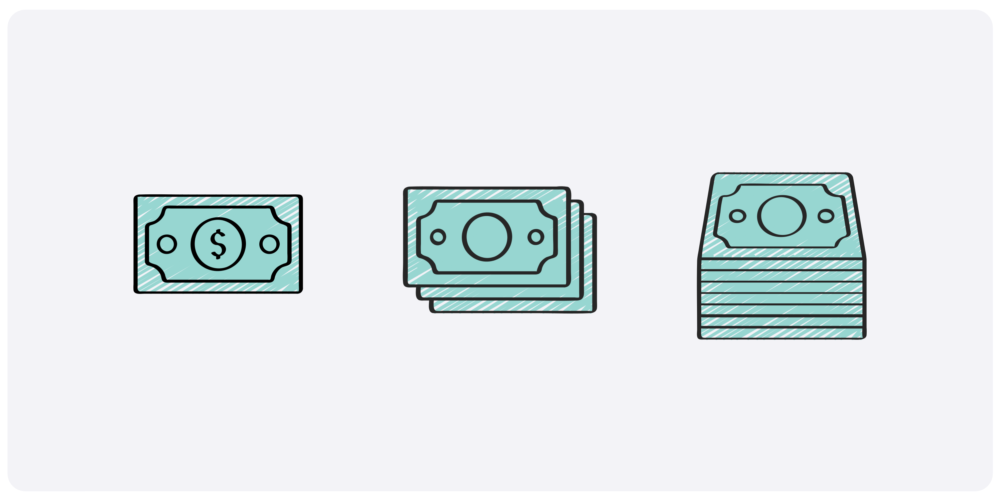

**<GlossaryTerm id="nft" />s** are not interchangeable; each token has its own unique identifier. Examples of NFTs are original art, gaming characters and pets, numbered collectibles, and more.

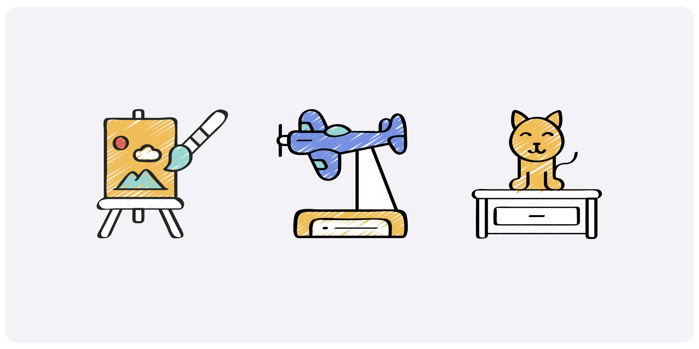

**Grouped NFTs** are Multi-unit tokens/NFTs that are a part of a family, and share the same Base ID.

:::warning Groups are being implemented.
Please note that Grouped tokens functionality is being implemented.  
This page will be updated once it is.
:::

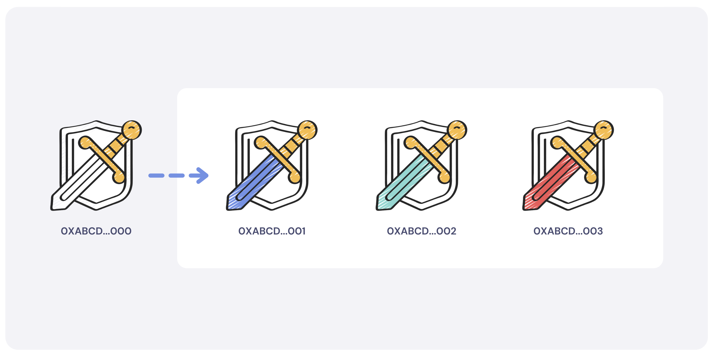

## Terminology

- **Collection - ** A group of tokens. Also holds data for those tokens and the policies that govern their behavior.
- **Token - **A unique asset with a balance
- **Token Account - ** A token account is stored in user account. It holds the account's <GlossaryTerm id="multitoken" /> states like its balance, freeze state, etc.
- **Policy - **Governs behavior for tokens in a collection
- **Attribute -** Metadata for a collection or a token
- **Operator -** An account that operates on behalf of another account (transferFrom)
- **Approval -** Required for an operator to use an account
- **Freeze/Thaw - **If a collection, token, or account is frozen, it cannot transfer tokens
- **Descriptor -** Used to create something. For example, a CollectionDescriptor creates a Collection.

## Collections

A collection must be created before tokens may be minted. A collection is somewhat akin to an ERC-1155 smart contract - both <GlossaryTerm id="nft" /> and <GlossaryTerm id="multi_unit_token" /> tokens can be created in a single collection, and its creator has certain privileges, such as minting new tokens or setting metadata for the collection and its tokens.

The first 2000 Collection IDs are reserved for future system collections. Collections created on-chain through this <GlossaryTerm id="extrinsic" /> start from ID 2001 and are sequentially created.

A <GlossaryTerm id="storage_deposit" /> of 6.25 ENJ is required to create a collection. The deposit can be recovered by the collection owner if all tokens are burned and the collection is destroyed.

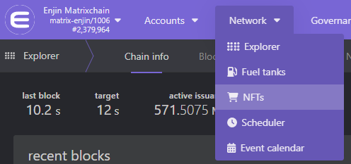

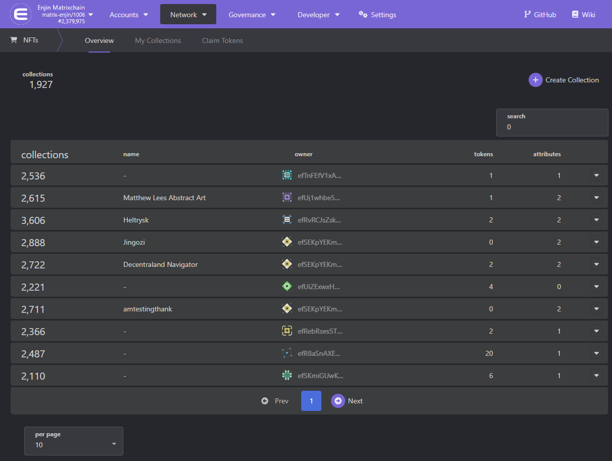

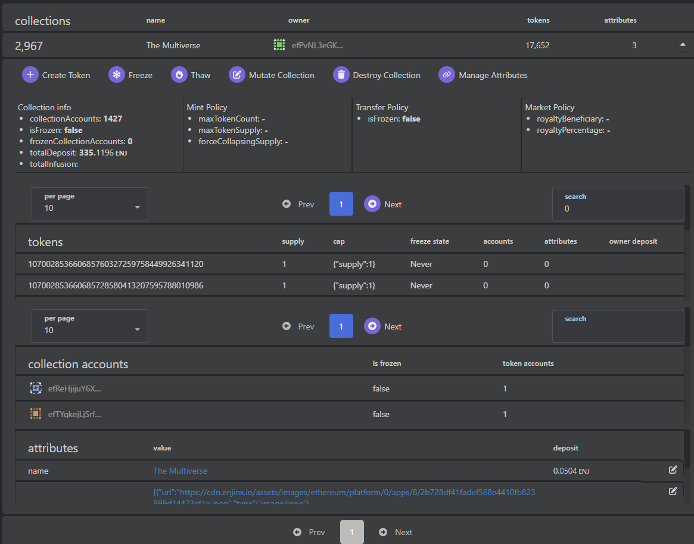

## Tokens

Each token must belong to a Collection, and is created using the mint extrinsic.

In the Enjin Blockchain there is no distinction between <GlossaryTerm id="multi_unit_token" />s and <GlossaryTerm id="nft" />s. Each token is a <GlossaryTerm id="multitoken" /> that may be a multi-unit token or an NFT depending on its supply. A NFT is simply a token with a total supply of one. Additional constraints, like a cap, can be applied to a token at the time of minting to make sure the total supply never increases.

## How to Create a Collection

A collection is created by using the `create_collection` extrinsic. The only required parameter is a descriptor which allows customizing the collection's behavior. The descriptor contains all of the policies and some additional settings. Some settings can be changed later using the `mutate_collection` extrinsic, but the policies currently cannot be changed, so think carefully before choosing the policies.

By default, the policies are flexible, but you can make them more strict. For example, if you want to force a collection to only contain NFTs, you can set `max_token_supply` to `1` and `force_collapsing_supply` to true on the mint policy.

### Create Collection Parameters

- Max Token Count: The maximum number of unique tokens that can exist within the collection, regardless of the supply of each token. Setting this to `None` allows for the creation of unlimited number of unique tokens within the collection.
- Max Token Supply: The maximum supply limit for each individual token within the collection. Setting this to 1 will ensure each token within the collection is an NFT.
- Force Collapsing Supply: Whether all tokens within the collection should have a collapsing supply. Read more on the available supply types in the [#Create Token Parameters](#create-token-parameters) section below.
- Market Policy: Whether each token within the collection should have forced marketplace royalties. Read more in the [#Create Token Parameters](#create-token-parameters) section below.
- Explicit Royalty Currencies: List of tokens that will be allowed to be used as a royalty currency for each filled listing of a token withing the collection. If no tokens are provided, all tokens will be allowed to be used as a royalty currency.  
  Read more in the [#Create Token Parameters](#create-token-parameters) section below.
- Attributes: The collection's attributes such as `name`, `description`, `media`, etc. These should be structured according to the [metadata standard](/02-tutorials/03-advanced-mechanics/02-metadata-standard/02-metadata-standard.md).

When the collection is created, it will emit a `CollectionCreated` event. This event contains the collection id that is used to access the collection.

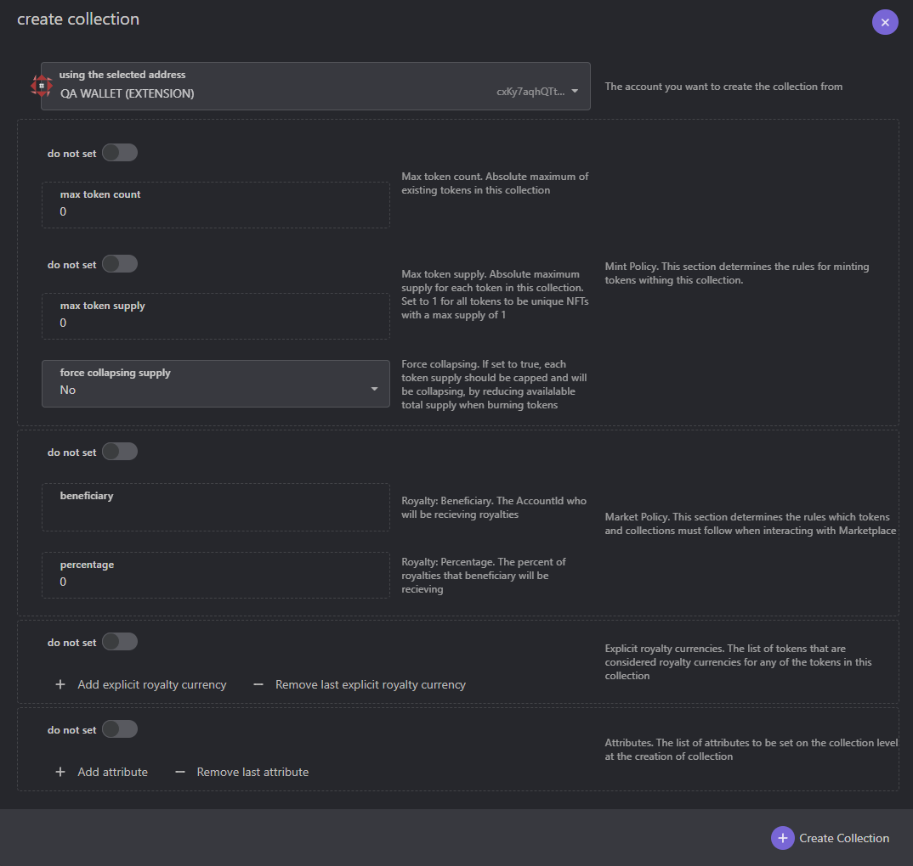

## How to create a Token

:::info Some deposits are required.
A single <GlossaryTerm id="storage_deposit" /> of 0.01 ENJ is required to store the token on-chain. This deposit also covers the first <GlossaryTerm id="token_account_deposit" />.  
An additional <GlossaryTerm id="token_account_deposit" /> of 0.01 ENJ is required for each new token holder.
:::

Tokens are created using the `mint` extrinsic. It only contains three parameters, the `recipient`, the `collection_id` and `mint params`. The mint params is an enum with a two variants: CreateToken and Mint.

`CreateToken` is used to create a new token and set its configuration such as cap, metadata, royalty, etc.  
`Mint` is used to mint additional units to an existing token.

### CreateToken

This must be used the first time a token is created. The provided token id must not already exist. Some additional settings can be chosen when creating a token, such as setting a cap on the supply or giving it a royalty for the marketplace.  
Some of these settings can be changed later by using the `mutate_token` extrinsic.

To create an NFT, set the cap: `supply`/`collapsing supply` to `1`.

#### Create Token Parameters

- <GlossaryTerm id="token_id" />: A unique token identifier for the new <GlossaryTerm id="multitoken" />. View the [TokenID Structure](/02-tutorials/03-advanced-mechanics/01-tokenid-structure.md) page for more information.
- Initial Supply: The amount of token supply to initially <GlossaryTerm id="mint" /> to the recipient account.
- Account Deposit Count: The number of accounts to reserve ENJ to, for <GlossaryTerm id="token_account_deposit" /> required for future `mint`/`transfer` operations. More info in the [#Account Deposit](#token-account-deposit) section below.
- Supply Cap
  - None: Infinite Supply
  - Supply: Set a maximum supply amount for the token. Burned units may be re-minted.
  - Collapsing: Set a maximum supply amount for the token. Burned units may not be re-minted. (i.e. burning units decreases the maximum supply)
- Token Market Behavior: (can be changed later on using the `MutateToken` extrinsic)
  - None: No Royalties.
  - Has Royalty: Set a percentage of ENJ royalty for each filled listing on the marketplace.
  - isCurrency: Allows this new token to be used as royalty (instead of ENJ royalty) for other tokens in the collection.  
    **\*Note**: setting a MultiToken currency as royalty isn't implemented on-chain as of now and only acts as a placeholder.
- Listing Forbidden: Whether this token should be prevented from listing on the marketplace (can be changed later on using the `MutateToken` extrinsic)
- Freeze State:
  - None: Not initially frozen.
  - Permanent: Token will be frozen permanently and can never be transferred to another account.
  - Temporary: Token will be frozen temporarily, can be thawed by the collection owner to allow transferring.
  - Never: Token will always be transferrable and can never be frozen.
- Metadata: The parameters below are for creating a token with decimal support, like a in-game currency.
  - Name: The token name. Can be set to `0x` to provide an empty name. (this name takes precedence when the token name is provided in different parameters such as `uri`/`name` attributes)
  - Symbol: The token symbol to be shown in different apps.
  - Decimals: The token's decimals count.  
    Please note, this parameter does not affect the token's behavior on-chain and is used solely for display purposes in applications. It helps apps determine how to format and present the token's total supply.  
    e.g. A token with `supply: 175` and `decimals: 2` should be formatted as `1.75`.
- ENJ Infusion:
  - Infusion: The amount of ENJ to infuse to each unit. (More info in the [#ENJ Infusion](#enj-infusion) section below)
  - Anyone Can Infuse: Whether anyone will be able to add infusion to this token, or only the collection owner.

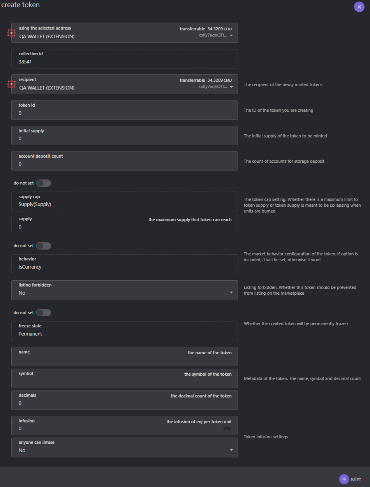

### Mint

This is used when minting additional units to an already existing token, as long as the circulating token supply didn't reach its cap.

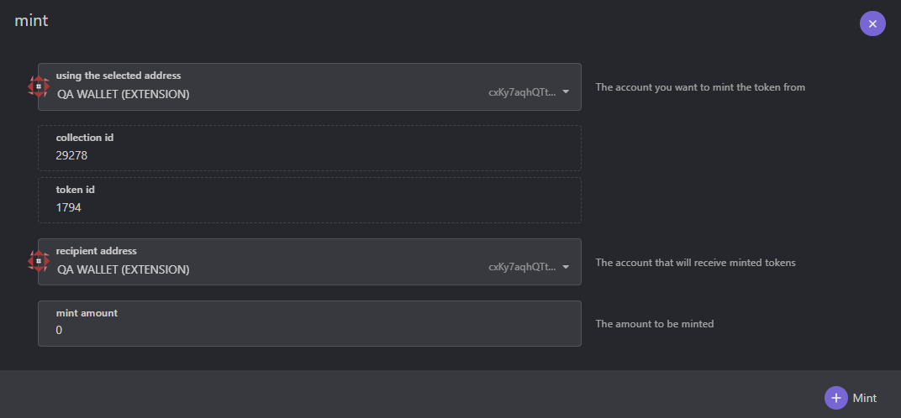

## Transferring tokens and NFTs

To perform a transfer, use the `transfer` extrinsic. There are two types of transfers:

### Simple Transfer

A simple transfer is when the `origin` of the extrinsic is also the sender. i.e. when the account that calling the extrinsic is also the token holder.

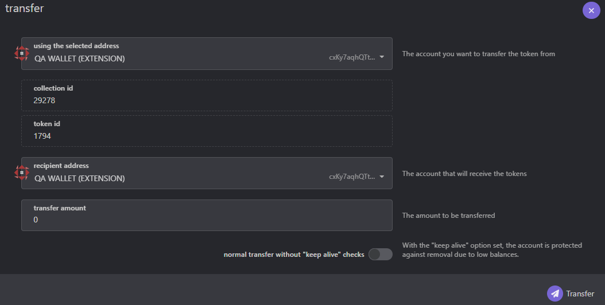

### Operator Transfer

An operator transfer is when an account makes transfers on behalf of another account. This is also known as `transfer_from`. 

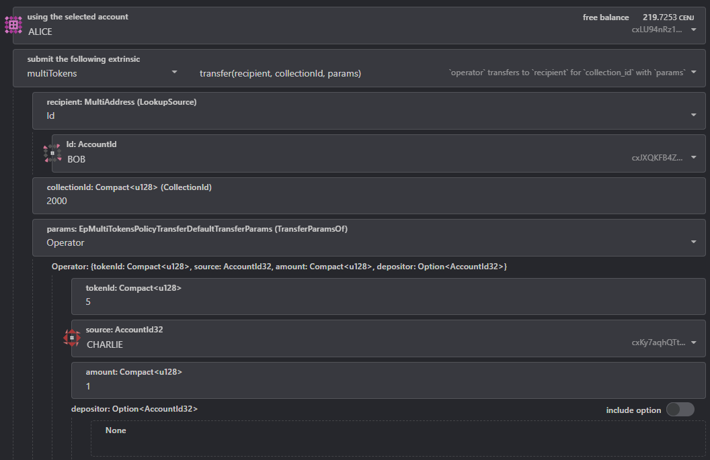

In the example above, Alice is creating a transaction call to transfer a MultiToken to Bob's account from Charlie's account.  
For the transaction to be successful, Bob must approve Alice to transfer this token in advance.

#### Transfer Approvals

Approvals can be set for entire collections, or they can be set for specific tokens. They can have expiration times, and specific balances can be set for token approvals. The following extrinsics are used for approvals:

- **approve_collection -** Approves all tokens in a collection.
- **approve_token -** Approves a specific token in a collection for a specific amount. For security reasons, you must specify the exact amount of the previous approval (or zero if there is none) in the `current_amount` parameter for the extrinsic to succeed.
- **unapprove_collection -** Revokes a collection approval.
- **unapprove_token -** Revokes a token approval.

## Burning Tokens

Burning a <GlossaryTerm id="multitoken" /> refers to the act of destroying token units. Tokens can be burned by invoking the `burn` extrinsic.

For tokens with the "Collapsing Supply" cap type, burning token units decreases the maximum supply of the token, ensuring that any burned units cannot be re-minted.

### Melting a Token

"Melting" is a term used to describe the process of burning a <GlossaryTerm id="multitoken" /> that contains an <GlossaryTerm id="enj_infusion" />. This process not only destroys the token but also releases the infused ENJ to the token holder.  
Read more in the [#ENJ Infusion](#enj-infusion) section below.  
Note that "melting" is a conceptual term and does not exist as a specific function in the blockchain code.

### Destroying Token Account

When an account burns all of the units it owns from a specific token, its <GlossaryTerm id="token_account" /> is destroyed and its <GlossaryTerm id="token_account_deposit" /> is released. Read more in the [#Token Account Deposit](#token-account-deposit) section below.

### Burning and Removing the Token from Storage

There is an additional field on the `BurnParam` called `remove_token_storage`. If this is set to `true` and the token's circulating supply is zero, the token will be removed from the blockchain storage, effectively destroying the token from existence. This action can only be performed by the collection owner.

When a <GlossaryTerm id="multitoken" /> is removed from storage, the <GlossaryTerm id="storage_deposit" /> is returned to the collection owner, and it will be as if the token never existed, so it can be recreated in the future with different configuration.

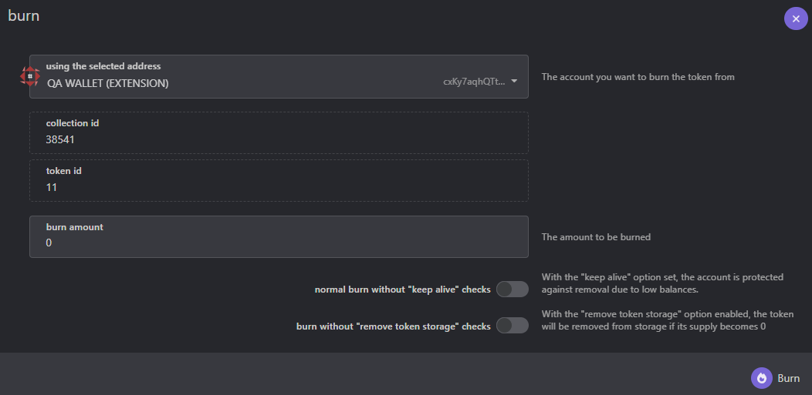

## Setting/Removing Attributes

To add or update metadata for a token or a collection, use the `set_attribute` extrinsic. Providing `token_id` sets the attribute to the token, otherwise it sets it directly to the collection. It's only callable by the collection's owner.

To remove an `attribute`, use `remove_attribute` extrinsic. It's only callable by the collection owner. If the `token_id` is provided, the attribute will be removed from the token. Otherwise, it will be removed from the collection.

### Setting Collection Attributes

This is done by clicking the `Manage Attributes` button under the expanded collection. Use the toggle to switch between setting and removing attributes.

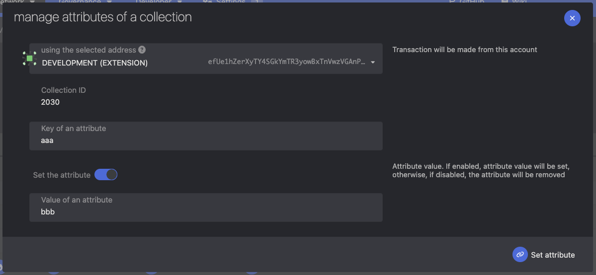

### Setting Token Attributes

This is done by clicking the `Manage Attributes` button on the token page. Use the toggle to switch between setting and removing attributes.

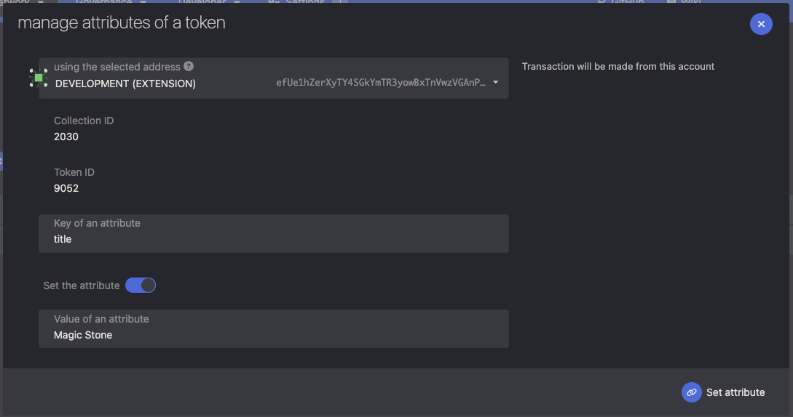

## Freezing

Accounts, collections, and tokens can be frozen to prevent transfers. This is done using the `freeze` extrinsic, which expects freezing `info` to be provided. The `info` specifies whether the <GlossaryTerm id="collection" />, <GlossaryTerm id="multitoken" />, Collection Account or <GlossaryTerm id="token_account" /> should be frozen.

### Freeze a collection or a collection account

This is done by clicking on Freeze button under expanded collection.  
Use the toggle to switch between freezing a specific collection account and the whole collection.

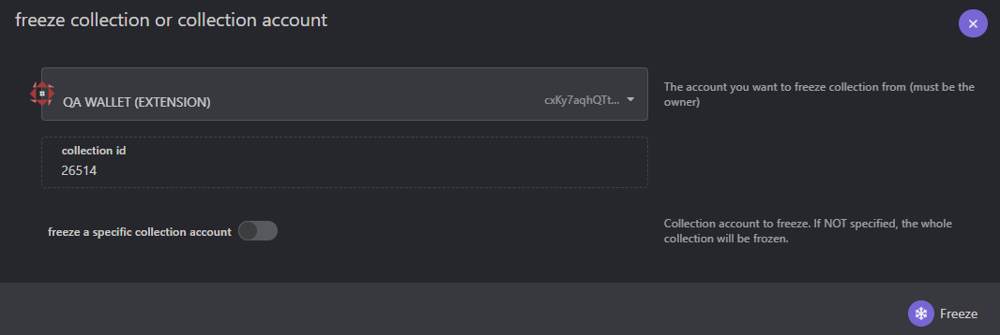

### Freeze a token or a token account

This is done by clicking on Freeze button on the token page.  
Use the toggle to switch between freezing a specific token account and the whole token.

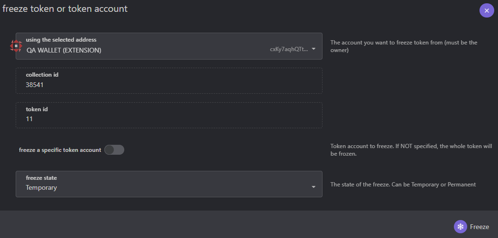

## Thawing

To unfreeze either collection, token, collection account or token account, use the thaw extrinsic. It expects the same `info` as the `freeze` extrinsic.

### Thaw a collection or a collection account

This is done by clicking on the `Thaw` button under expanded collection.  
Use the toggle to switch between thawing a specific collection account and the whole collection.

### Thaw a token or a token account

This is done by clicking on the `Thaw` button on the token page.  
Use the toggle to switch between thawing a specific token account and the whole token.

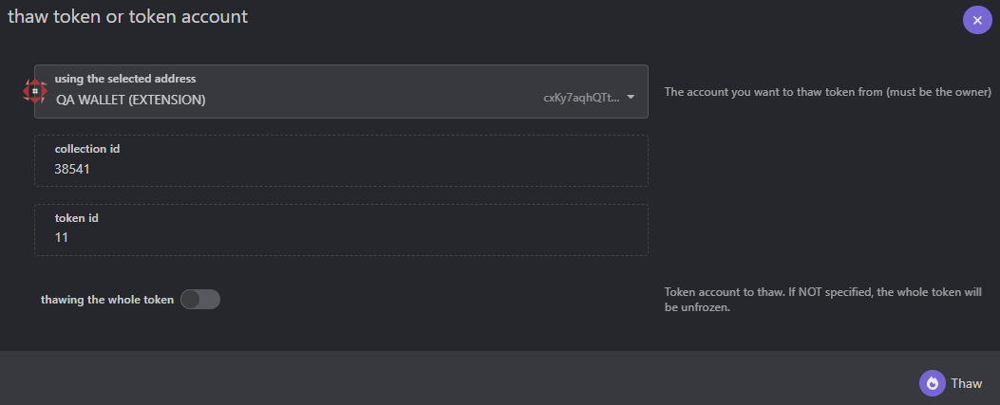

## Batch operations

It is also possible to perform certain operations in batch. The following operations are supported:

### Batch Transfer

Using `batch_transfer` you can batch [transfer](#transferring-tokens-and-nfts) operations, allowing to transfer multiple tokens from a single collection, to a list of `recipients` with different `amount` of tokens.

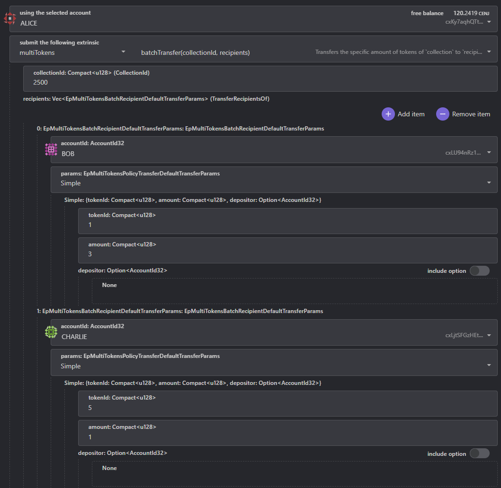

### Batch Mint

Using `batch_mint` you can batch [mint](#how-to-create-a-token) operations, allowing minting new or existing tokens, each with it's own `recipient` and `amount`.

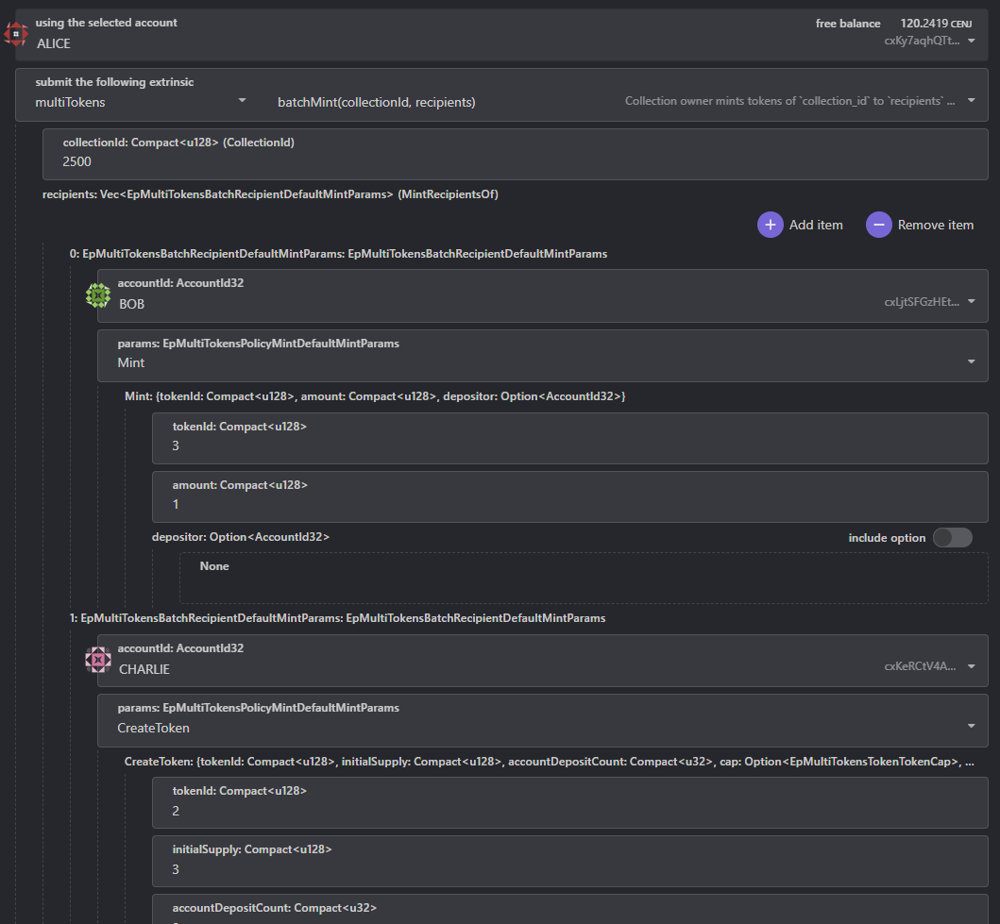

### Batch Set Attribute

Using `batch_set_attribute` you can batch set attribute operations, allowing to set multiple attributes to a single collection / token. If `token_id` is `None`, the attribute is set on the collection. If it is `Some`, the attribute is set on the token.

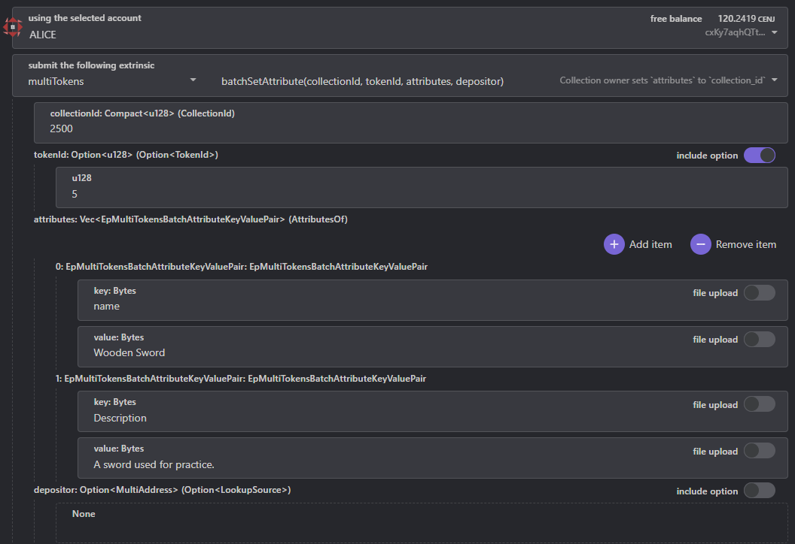

### Remove All Attributes

Removes all attributes from the given `collection_id` or `token_id`.  
If `token_id` is `None`, it removes all attributes of the collection. If `token_id` is `Some`, it removes all attributes of the token. `attributeCount` must match the number of attributes set in the collection/token, or the transaction will fail.

## ENJ Infusion

The ENJ Infusion of a token represents the backing value of each unit in ENJ, which is returned to the token holder when it's <GlossaryTerm id="burn" />ed.

Each token unit may have some ENJ infused into it. The token creator can choose to infuse ENJ to any of its tokens at any  given time, or at the time of creation.

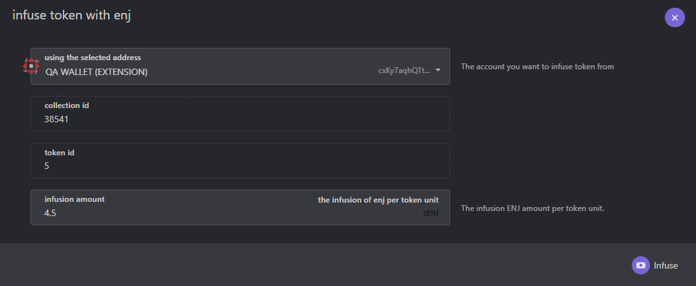

Infused ENJ can only be retrieved by [burning the token supply](#burning-tokens).  
Burning the token releases the ENJ to the holder.

In addition, the token creator can choose to allow anyone to add ENJ infusion to an existing token, or restrict it so only the creator can add ENJ infusion.

## Token Account Deposit

On top of the <GlossaryTerm id="storage_deposit" /> required to store the token on-chain, a Storage Deposit of 0.01 ENJ is required to store each Token Account on-chain.  
A Token Account is created when an account has a <GlossaryTerm id="multitoken" /> balance of 1 or more, and it is destroyed when that balance becomes zero.

It's important to note that the storage deposit is required for each new Token Account created, not for the total supply of tokens minted.  
For example:  

- Minting/transferring 1,000 of a single MultiToken to **a single recipient account that doesn’t already hold a balance of that token** will require creating a Token Account for that recipient. This process incurs a one-time storage deposit of only 0.01 ENJ, covering the entirety of the 1,000 tokens.  

- Minting/transferring any balance of a single MultiToken to **1,000 different recipient accounts, each of which doesn’t already hold a balance of that token**, will require creating a Token Account for each recipient. This process incurs a storage deposit of 0.01 ENJ per account, resulting in a total deposit of 10 ENJ.  

The token creator can reserve some ENJ for Account Deposits on token creation with the `account_deposit_count` field.  
ENJ reserve for Account Deposits can be added / removed ahead of time by any account, with the `update_account_deposit` extrinsic.

On a `mint`/`transfer` operation, if a new Account Deposit is needed and there's no account deposit in reserve, the ENJ required for the account deposit will be taken on demand from the account that performed the mint or transfer. If it is an operator transfer, it is taken from the source account.  
In the future, if the created Token Account is destroyed, the ENJ used for the Account Deposit is returned to the account that originally reserved the on-demand deposit.
