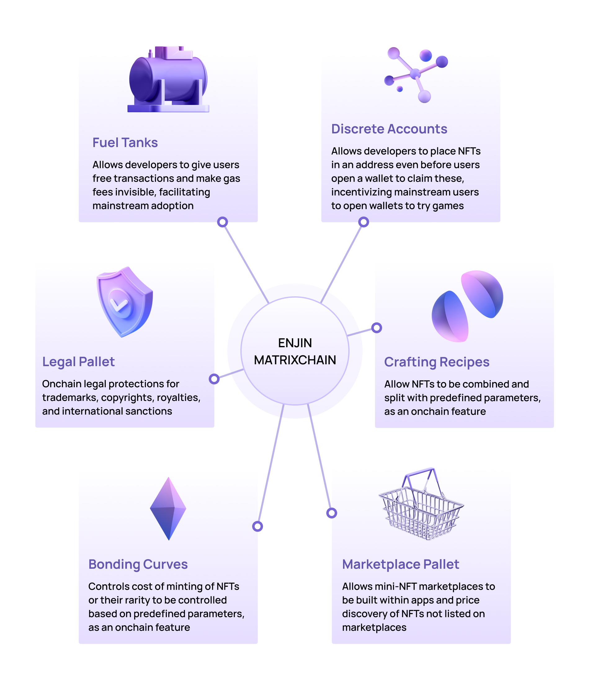

import GlossaryTerm from '@site/src/components/GlossaryTerm';

# What is the Enjin Matrixchain?

Enjin is a blockchain platform that provides a developer-friendly Matrixchain built on the Enjin Relaychain specifically designed for digital assets. Unlike most digital assets that run on general-purpose chains, Enjin provides faster on-chain digital asset creation and interactions, greater security, interoperability, and flexibility.  
Enjin's digital asset functionality is built right into the protocol level, allowing developers to focus on building their apps instead of worrying about security and functionality. Enjin's developer-friendly approach offers a simplified and streamlined experience that can accelerate the creation and adoption of digital assets on the blockchain.

# Enjin Matrixchain Features

The Enjin Matrixchain incorporates an array of features that enable digital asset creation, minting, transfer, on-chain marketplace actions, royalties, crafting, swapping, fuel tanks, and more. These features are integrated into the chain protocol, making them readily accessible to all users without requiring additional setup. However, if users require specific functionality not included in the core protocol, they can leverage custom smart contracts to extend the capabilities of the platform. This flexibility ensures that Enjin can accommodate a wide range of use cases, from simple transactions to complex asset interactions.

- Asset minting: Minting assets on Enjin is highly customizable, supporting the creation of both <GlossaryTerm id="multi_unit_token" /> and non-fungible (<GlossaryTerm id="nft" />) assets, with capped or uncapped supply. With these features, Enjin provides a versatile platform for creating and distributing digital assets that can meet a wide range of use cases.
- Fuel Tanks: Enjin's Fuel Tanks feature enables the subsidization of transaction fees for different actions on the platform. This feature is highly customizable, allowing users to define custom parameters and rules that suit their specific use case. By providing this flexibility, Enjin can accommodate a wide range of transaction types, from simple transfers to more complex asset interactions.
- On-Chain Marketplace: The On-Chain Marketplace offers marketplace functionality at the protocol level, which allows for the trading of any item without requiring token listings or even their existence on the network. This feature enhances price discovery by enabling bids on non-listed tokens. Additionally, the marketplace functionality on the protocol level guarantees that royalties will be credited for all asset sales, regardless of the marketplace on which the sale occurred, without requiring custom smart contracts.
